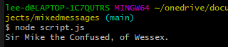

# Mixed-Messages (Codecademy Project)
## Random Medieval Name Generator

### Introduction

This is a small program I have made with the goal of taking data from 4 different arrays to create a randomised message in the form a made up name consisting of a title, a name, a secondary title and location.

### Technologies

- Javascript
- Node
- Git and Github

### Screenshots

